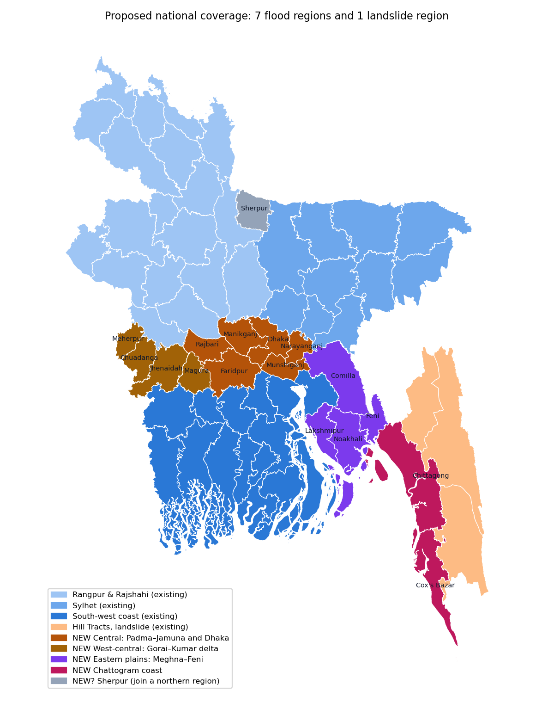

# National flood coverage: scope

Status: proposal, 2026-10-01. Nothing here has been run. The JFRM paper keeps
its three regions; this is the next phase of the system and the website.

## Where coverage stands

The three flood regions reach 44 of Bangladesh's 64 districts, measured by
where their mapped assets fall. Twenty districts are not covered, 41,662 km²
or 30 % of the country. Three of them (Bandarban, Khagrachhari, Rangamati) are
the Hill Tracts, which belong to the landslide model, so national flood
coverage needs 17 more districts, about 28,500 km².

| Region | Districts | Area | Assets now | Assets per km² |
|---|---|---|---|---|
| Rangpur & Rajshahi | 19 | 41,685 km² | 23,016 | 0.55 |
| Sylhet | 10 | 27,002 km² | 13,374 | 0.50 |
| South-west coast | 15 | 29,702 km² | 29,545 | 0.99 |
| Hill Tracts (landslide) | 3 | 13,205 km² | — | — |

District areas are whole districts; the existing regions are bounding boxes
and cover some districts only in part.

## Proposed regions

Each region is chosen for one flood regime, because the model learns one
regime well and a mixture badly: the south-west coast, where surge and
riverine flooding meet, is where the hazard surface is weakest.

| New region | Districts | Area | Flood regime |
|---|---|---|---|
| Central: Padma–Jamuna and Dhaka | Dhaka, Narayanganj, Munshiganj, Manikganj, Faridpur, Rajbari | 7,681 km² | riverine at the confluence, urban waterlogging in Dhaka |
| West-central: Gorai–Kumar delta | Chuadanga, Meherpur, Jhenaidah, Magura | 4,908 km² | moribund delta; seasonal waterlogging, little river flooding |
| Eastern plains: Meghna–Feni | Comilla, Feni, Noakhali, Lakshmipur | 7,918 km² | flash floods from the Tripura hills, estuarine and surge flooding |
| Chattogram coast | Chittagong, Cox's Bazar | 6,621 km² | cyclone surge, hill-fed flash floods, urban waterlogging |
| Sherpur | Sherpur | 1,328 km² | Garo-hills flash floods; too small alone, see decisions |

With these, the website's "All" view becomes all of Bangladesh: seven flood
regions and the landslide region.

## Flood events each region needs

The labelling rule needs at least two mapped floods per region (a pixel is
flood-prone where it flooded in at least two events), or one for a surge
coast. The candidates below come from memory of the flood record and have
**not** been checked; each must be confirmed against ReliefWeb situation
reports, as the existing events were, and against Sentinel-1 coverage of
the window, before a run.

| Region | Candidate events (to verify) |
|---|---|
| Central | August 2017 Jamuna flood; July 2019; July–August 2020, long and severe in Faridpur, Manikganj and Munshiganj |
| West-central | Few river floods; waterlogging after heavy rain in Jessore and the Bhabadah area in 2023–2024. May not yield enough flooded pixels to train on |
| Eastern plains | August 2024 eastern flash floods (Feni, Comilla, Noakhali, Lakshmipur); Cyclone Remal, May 2024 |
| Chattogram coast | August 2023 Chattogram and Cox's Bazar floods, the storm behind the landslide inventory; Cyclone Mocha, May 2023; Cyclone Hamoon, October 2023 |

## Risks

1. **West-central may not train.** Waterlogging is patchy and slow, and the
   region may hold too few flooded pixels for the two-event rule. It may need
   the one-event rule the coast uses, or be reported as untrained.
2. **Dhaka's urban flooding is hard for radar.** Buildings scatter the signal
   back, so flooded streets rarely read as open water, and the Central labels
   will under-record the city. Its results should be read for the rural
   confluence, not for urban waterlogging.
3. **The coastal weakness spreads.** The Eastern plains and Chattogram coast
   are surge-exposed, and the terrain predictors do not describe embankments
   or tides. Expect hazard surfaces near chance there until embankment and
   tide data are added, which is the largest gap in the system.
4. **Regions overlap.** The existing regions are bounding boxes; the Sylhet
   box already reaches into Gazipur and Narsingdi. New regions should be
   defined by district lists (a small pipeline change, below), and the web
   build should keep each mapped asset once where boxes overlap.

## What has to be built

1. **District-defined regions.** A configuration key listing a region's
   districts, applied the way the border clip is (`pipeline/country.py`):
   assets, grid cells and grid-level validation outside the listed districts
   are dropped. Existing regions keep their boxes, so the paper's numbers do
   not move.
2. **One asset per place in the national view.** The web build drops an
   asset already held by an earlier region (same OpenStreetMap id).
3. **Four region configurations**, each with its events and their ReliefWeb
   sources.
4. **The website**, which needs no change beyond the new regions: the
   region buttons, filters and "All" view are already data-driven.

## Time and space

Measured on the existing regions: rerunning three regions from features to
the 20-assignment benchmark took about 18 minutes with the three in
parallel. Terrain preprocessing takes minutes per region. The new regions
are smaller than the existing ones (5,000–8,000 km² against 27,000–42,000),
so each should be quicker.

| Step | Estimate for the four new regions |
|---|---|
| OpenStreetMap download | 1–3 hours, rate-limited by the public servers |
| Sentinel-1 mapping in Earth Engine | minutes per event, about 10 events |
| Terrain preprocessing | under 30 minutes in all |
| Models, validation, benchmark | under an hour |
| Assets | about 20,000–40,000 more; Dhaka and Chittagong are denser than the current average |
| Disk | about 4–6 GB more; the SSD has 37 GB free |

## Decisions needed

1. **Sherpur.** Join Rangpur & Rajshahi (which already holds neighbouring
   Jamalpur) or Sylhet, or stay uncovered. Joining changes an existing region,
   so its numbers would move; doing it after the paper is accepted avoids that.
2. **West-central.** Attempt it with a one-event rule, or leave it out until
   a waterlogging-specific label exists.
3. **Order.** Suggested: Eastern plains first (the August 2024 floods are
   well documented), then Central, Chattogram coast, West-central last.
4. **Existing regions.** Keep their boxes (the paper's numbers stay fixed) or
   redefine them by districts too, for a clean national partition, after the
   paper.
