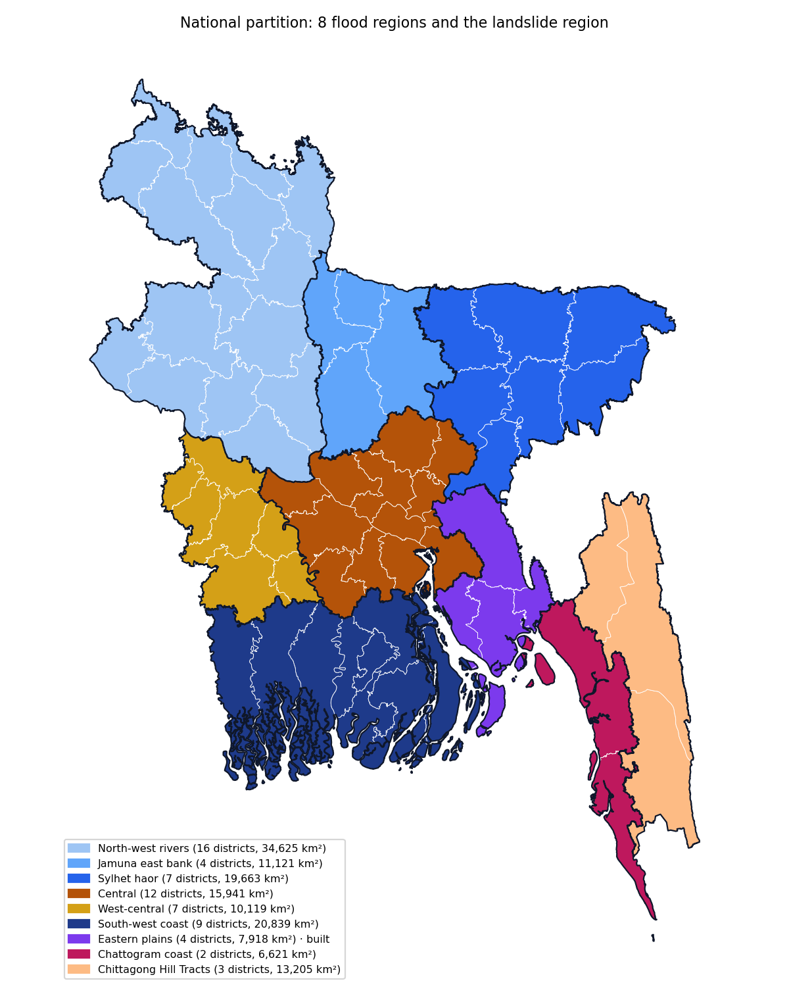

# National flood coverage

Status: built 2026-10-02. All 64 districts of Bangladesh belong to one of eight
flood regions or to the Chittagong Hill Tracts landslide region
(`configs/national/partition.yaml`). The website shows this partition. The
JFRM paper keeps its three bounding-box regions (`config.yaml`,
`configs/sylhet.yaml`, `configs/sw_coastal.yaml`), whose outputs are unchanged.

## Regions

Each region holds one flood regime, because the model learns one regime well
and a mixture badly. Regions are defined by their districts (`aoi.districts`),
so assets, grid cells and validation outside them are dropped
(`pipeline/country.py`), and no asset is counted in two regions.

| Region | Districts | Regime | Events | Rule | Assets |
|---|---|---|---|---|---|
| North-west rivers | 16, Panchagarh to Pabna | Teesta and Brahmaputra–Jamuna riverine | Aug 2017, Jul 2019, Jul 2020, Jul 2024, Oct 2024 | 2 events | 21,893 |
| Jamuna east bank | Sherpur, Jamalpur, Mymensingh, Tangail | riverine and Garo-hills flash floods | Aug 2017, Jul 2019, Jul 2020, Oct 2024 | 2 events | 5,415 |
| Sylhet haor | 7, Sylhet to Brahmanbaria | flash floods into the haor basin | Apr 2017, Jun 2022, Jun 2024, Aug 2024 | 2 events | 13,402 |
| Central | 12, Dhaka to Chandpur | Padma–Meghna confluence, Dhaka | Aug 2017, Jul 2019, Jul 2020 | 2 events | 20,218 |
| West-central | 7, Kushtia to Narail | waterlogging in the moribund delta | Sep 2024 Jessore, Jul–Aug 2025 Bhabodah | 1 event | 4,398 |
| South-west coast | 9, Satkhira to Bhola | cyclone surge and tides | Amphan 2020, Yaas 2021, Sitrang 2022, Remal 2024 | 1 event | 26,039 |
| Eastern plains | Comilla, Feni, Noakhali, Lakshmipur | flash floods and surge | Aug 2024, Remal 2024, Feni Jul 2024 | 1 event | 9,461 |
| Chattogram coast | Chittagong, Cox's Bazar | hill-fed flash floods and surge | Aug 2023, Aug 2024, Remal 2024 | 1 event | 13,743 |

That is 114,569 flood-mapped assets, from Geofabrik's national OpenStreetMap
extract of 30 September 2026 (`data.osm.source: pbf`).

Every event was checked twice before a run: a humanitarian report or national
newspaper confirms flooding in the region's districts with dates, and
Sentinel-1 imaged the region during the flood and in that year's dry-season
baseline (`scripts/check_s1_events.py`). The sources sit beside each event in
`configs/national/events/` and in the region files; the Eastern plains check
is written up in `eastern_plains_events.md`. Events dropped at this step:
Cyclone Sitrang for the Eastern plains and Cyclone Mocha for the Chattogram
coast (first pass four days or more after landfall), and Cyclone Hamoon
(54 % of the coast imaged).

## Results

Validation is on held-out 10 km blocks, repeated over 20 block assignments.

| Region | Flood-prone | AUC, 20 assignments | AUC vs observed floods | Radar labels over terrain labels | Graph network minus best | Terrain hazard surface |
|---|---|---|---|---|---|---|
| North-west rivers | 6.2 % | 0.821 ± 0.049 | 0.878 | +0.103 (19 of 20) | −0.036 | 0.735 |
| Jamuna east bank | 6.4 % | 0.815 ± 0.074 | 0.726 | +0.156 (19 of 20) | −0.022 | 0.365 |
| Sylhet haor | 14.9 % | 0.835 ± 0.049 | 0.840 | +0.079 (19 of 20) | −0.005 | 0.814 |
| Central | 3.0 % | 0.914 ± 0.042 | 0.939 | +0.118 (19 of 20) | −0.019 | 0.605 |
| West-central | 3.2 % | 0.724 ± 0.186 | 0.574 | +0.024 (12 of 20) | −0.076 | 0.657 |
| South-west coast | 5.0 % | 0.799 ± 0.058 | 0.802 | +0.070 (16 of 20) | −0.005 | 0.617 |
| Eastern plains | 4.3 % | 0.743 ± 0.122 | 0.854 | +0.181 (17 of 20) | −0.088 | 0.546 |
| Chattogram coast | 3.5 % | 0.832 ± 0.118 | 0.637 | +0.084 (15 of 19) | −0.023 | 0.839 |

AUC over 20 assignments is the gradient-boosting model's. The graph network
trails the best tabular model in every region, as in the paper's regions.

Four regions have floods both before and after 2022, so a model trained to
2022 could be scored on the 2024 floods:

| Region | Scored on | Trained to 2022 | Flood record as a predictor |
|---|---|---|---|
| North-west rivers | Jul and Oct 2024 | 0.799 | 0.899 |
| Jamuna east bank | Oct 2024 | 0.677 | 0.901 |
| Sylhet haor | Jun and Aug 2024 | 0.785 | 0.858 |
| South-west coast | Remal 2024 | 0.770 | 0.662 |

As in the paper, the past flood record predicts the next riverine and haor
floods better than the model does, and on the surge coast the model is ahead.
Central's events all fall before 2022, and the West-central, Eastern plains
and Chattogram coast events all fall after it, so those four regions are
validated on held-out blocks only.

## Reading the results

1. **Radar labels help everywhere, least in West-central.** Training on mapped
   floods beats training on terrain-derived labels in every region, by
   0.07 to 0.18 AUC, but in West-central by only 0.024 and in 12 of 20
   assignments.
2. **West-central is low-data and is marked so on the website.** Its two
   waterlogging events are documented only in newspapers, its skill swings
   widely between block assignments (± 0.186), and its scores agree weakly
   with observed floods (0.574). Its scores are indicative only.
3. **The terrain hazard surface fails where water does not follow terrain.**
   It is near or below chance in the Jamuna east bank (0.365) and the Eastern
   plains (0.546), where embankments, flash floods and standing water decide
   where flooding lies, and strongest in the haor (0.814) and the Chattogram
   coast (0.839). Embankment and tide data remain the largest gap.
4. **Dhaka's urban flooding is under-recorded.** Buildings return radar
   signal, so flooded streets rarely read as water. Central's high AUC
   describes the rural confluence more than the city.
5. **Small regions are noisy.** The Eastern plains and Chattogram coast hold a
   few hundred flood-prone assets each, so some held-out blocks hold few
   or none, which is where their wide spreads come from.

## What was built

- District-defined regions (`aoi.districts`), applied with the border clip in
  `pipeline/country.py`.
- Assets from the national extract, converted once into an indexed file
  (`data/shared/osm/`), after the public Overpass servers throttled the
  queries. The Overpass fetch also became resumable, splitting a query the
  server cannot answer.
- Sentinel-1 downloads split into quarters when Earth Engine refuses a large
  region.
- A fix to the flood threshold, which with three events had made the
  one-event rule act as a two-event rule. The papers' numbers are unchanged.
- Region configurations generated from the partition
  (`scripts/make_region_config.py`), and a web build that shows the
  partition and leaves the paper's box regions off the website.
